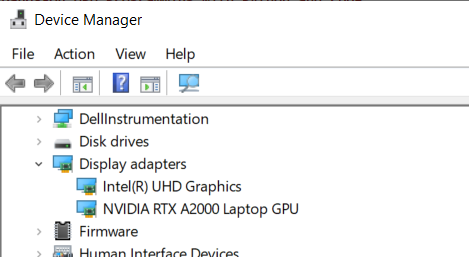
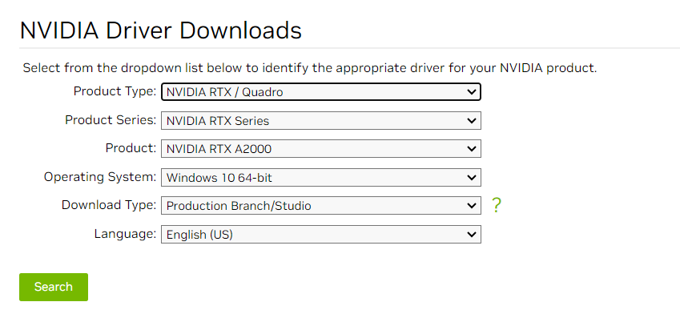
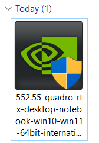
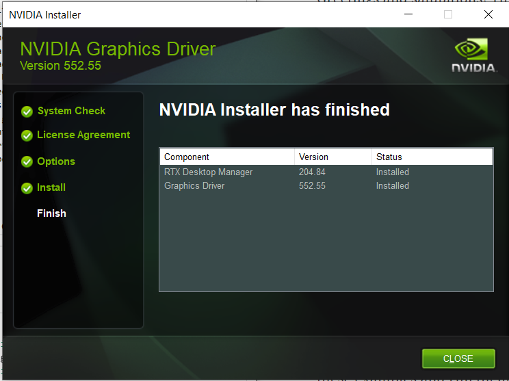
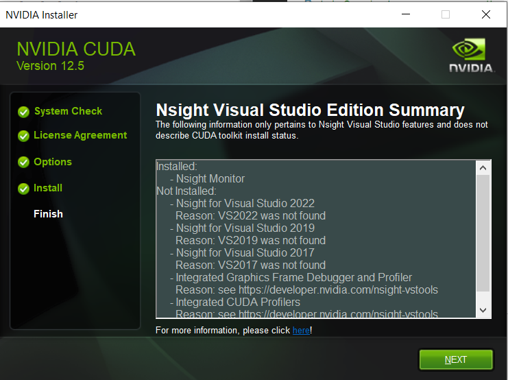
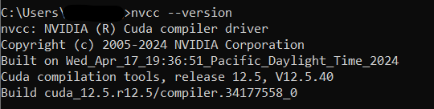
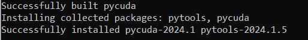
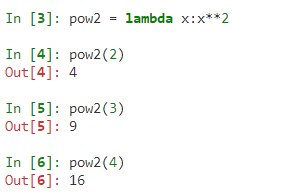
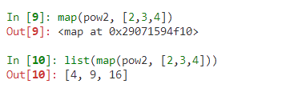
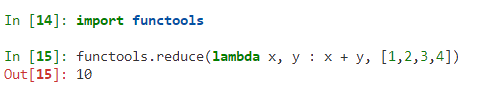

# Hands-On GPU Programming with Python and CUDA - Notes
<a href="https://www.packtpub.com/application-development/hands-gpu-programming-python-and-cuda?utm_source=github&utm_medium=repository&utm_campaign=9781788993913 "></a>

This is the forked code repository for [Hands-On GPU Programming with Python and CUDA](https://www.packtpub.com/application-development/hands-gpu-programming-python-and-cuda?utm_source=github&utm_medium=repository&utm_campaign=9781788993913 ), published by Packt. 

Below contains notes, keypoints taken from the book and notebooks (.ipynb) created for learning purposes, feel free to check out 📖

### Chapter 01: Why GPU Programming? Technical requirements, Parallelization and Amdahl's Law, Code Profiling
-  CUDA (Pronunciation: coo-duh), a framework for general-purpose GPU (GPGPU) programming from NVIDIA
- Amdahl's Law
    - A method to estimate potential speedup we can get by offloading a program or algorithm onto a GPU/ for a program that can be at least partially parallelized
    - Speedup = 1/((1-p)+p/N)
    - p = parallelizable proportion of execution time for code in original serial program
    - N = Number of processor cores
- Latency: Duration of performing a single computation.
- Power of GPU - TONS of cores MORE than in a CPU, which provides throughput
- Throughput: Number of computations that can be performed simultaneously
- "A GPU is like a very wide city road that is designed to handle many slower-moving cars at once (high throughput, high latency), whereas a CPU is like a narrow highway that can only admit a few cars at once, but can get each individual car to its destination much quicker (low throughput, low latency)."
- ⬆ number of cores of GPU, ⬆ in throughput
- Example: 
    - CPU - 11th Gen Intel(R) Core (TM) i7-11850H @2.50GHz: 8 cores
    - GPU - [NVIDIA RTX A2000](https://www.nvidia.com/content/dam/en-zz/Solutions/design-visualization/rtx-a2000/nvidia-rtx-a2000-datasheet.pdf): 3328 CUDA Cores
    - GPU - [NVIDIA RTX A4000](https://www.nvidia.com/content/dam/en-zz/Solutions/gtcs21/rtx-a4000/nvidia-rtx-a4000-datasheet.pdf): 6144 CUDA Cores
- Exploit throughput, know how to properly parallelize to split workload to run in parallel on multiple processors simultaneously
- Building a house (N number of laborers, N times as fast, N =  speedup of parallelizing a task over the serial version of a task) = parallelizable task
- Profiling code with cPython module, check out [Chapter01/mandelbrot0.ipynb](Chapter01/mandelbrot0.ipynb)
- Advantage of GPU over CPU = ⬆ throughput, execute more parallel code simultaneously on GPU than on a CPU
- "GPU cannot make recursive algorithms or nonparallelizable algorithms somewhat faster"
- Serial vs Parallelizable

### Chapter 02: Setting Up GPU Programming Environment, Technical & Hardware Requirements, GPU Drivers Installation, Setup C++ & Python development environment on Windows & Linux
- Setup Instructions setup available for Ubuntu LTS (long-term support)-based Linux OS (e.g.,  Xubuntu, Kubuntu, or Linux Mint) or Windows 10
- Fast pre-optimized NumPy/SciPy packages <= Intel's Math Kernel Library (MKL)
- Requiremenet: an NVIDIA brand GPU. The CUDA Toolkit is proprietary for NVIDIA cards, so it won't work for programming Intel HD or Radeon GPUs.
- Linux:
    - Open Terminal: `Ctrl + Alt + T`
    - Check processor: `lscpu`
    - Check memory capacity: `free -g` - Display total number of proper memory & memory in swap space
    - Check for Nvidia GPU: `lspci | grep -e "NVIDIA"`
    - Nouveau - an open-source default driver for NVIDIA GPUs in Ubuntu, buts does not work with CUDA
    - Install proprietary driver by adding `graphics-drivers` repository to package manager
        - `sudo add-apt-repository ppa:graphics-drivers/ppa`
        - Synchronize system with the new repo: `sudo apt-get update`
        - Press `Windows + R` and search `software and drivers`
        - Software & Drivers -> Additional Drivers -> Choose the lastest stable proprietary drivers for the GPU (e.g., Using NVIDIA driver metapackage from nvidia-driver-XXX (open source)) -> Apply Changes -> Wait... -> Press `Windows + A` -> Enter `nvidia-settings` -> NVIDIA X Server Settings manager
    - Setup GCC, Eclipse IDE, and graphical dependencies: 
        - `sudo apt-get update`
        - `sudo apt-get install build-essential binutils gdb eclipse-cdt`
            - `build-essential` - gcc, g++ compilers & other utilities such as make
            - `binutils` - useful utilities, such as the LD linker
            - `gdb` - debugger
            - `Eclipse` - IDE
        - `sudo apt-get install freeglut3 freeglut3-dev libxi-dev libxmu-dev` - allow our system to run graphical (OpenGL) stuff included with the CUDA Toolkit
    - Download & Install [CUDA Toolkit](https://developer.nvidia.com/cuda-downloads)
        - `.deb` package (recommended) & a `.run` file (This installs outside of the system's Advanced Package Tool - APT system, which copies the appropriate files to the system's /usr binary and library directories - do this if you know Linux well and know how to work with the Ubuntu's system APT system or repos)
        - Edit `.bashrc` file to configure PATH and LD_SYSTEM_CONFIG environment variables so that the system can find the appropriate binary executable and library files needed for CUDA.
        ```
        export PATH="/usr/local/cuda/bin:${PATH}
        export LD_LIBRARY_PATH="/usr/local/cuda/lib64:${LD_LIBRARY_PATH}"
        ```
    - Install PyCUDA
        - Check where the python binary `which python` else edit `~/.bashrc` file by adding `export PATH="/home/${USER}/anaconda2/bin:${PATH}"`
        - `pip install pycuda`

- Windows
    - Control Panel -> Device Manager
    - 
    - CUDA is very particular about which driver has been installed by the user.
    - "Windows has better CUDA driver compatibility and a more user-friendly installation than Linux."
    - Download & Install GPU drivers for Windows on [NVIDIA Driver Downloads](https://www.nvidia.com/download/index.aspx?lang=en-us)
        - 
        - 
        - 
    - [Install C/C++ on Windows - Guide](https://medium.com/@farid.rahimoff/installing-c-compiler-for-windows-10-and-11-step-by-st-51e760443b02)
    - Download & Install [Visual Studio Community](https://visualstudio.microsoft.com/downloads/)
    - Download & Install [CUDA Toolkit](https://developer.nvidia.com/cuda-downloads), nvcc compiler
        - 
        - 
        - 
        - Check the NVIDIA compiler version information: `nvcc --version`
        - 
    - Install PyCUDA: `pip install pycuda`
        - 
        - If you received error `ImportError: DLL load failed while importing _driver: The specified module could not be found.` when running [Chapter03/deviceQuery.ipynb](Chapter03/deviceQuery.ipynb), add `C:\Program Files\NVIDIA GPU Computing Toolkit\CUDA\v12.5\bin` to PATH

### Chapter 03: Getting Started with PyCUDA, GPU Programming via Python, Transfer data to and from using PyCUDA's gpuarray class, Compile simple CUDA kernels with PyCUDA's ElementwiseKernel function
- GPU Query: To display specific technical details of the GPU, such as available GPU memory and core count, check out [Chapter03/deviceQuery.ipynb](Chapter03/deviceQuery.ipynb)
- Use PyCUDA's gpuarray class to transfer data between the host (CPU) and device (GPU) -
    - Numerical Programming: NumPy's array
    - GPU Programming: PyCUDA's gpuarray
    - Device Memory/ Global DM: 
        - A GPU has its own memory apart from the host computer's (CPU) memory. GPU also has other memories such as additional cache memory, shared memory & register memory.
        - Similar to dynamically allocated heap memory in C (`malloc`, `free`) or C++ (`new`, `delete`)
    - CUDA C
        - Data transfer between  CPU & GPU (`cudaMemcpyHostToDevice`, `cudaMemcpyDeviceToHost`)
        - Keep track of multiple pointers in both the CPU and GPU space and performing proper memory allocations (`cudaMalloc`, `cudaFree`) 
    - Check out [Chapter03/time_calc0.ipynb](Chapter03/time_calc0.ipynb)
    - Check out [Chapter03/explore_gpuarray.ipynb](Chapter03/explore_gpuarray.ipynb)
- Use PyCUDA's ElementWiseKernel for performing pointwise computations
    - kernel: function that is launched directly onto the GPU by CUDA
    - Check out [Chapter03/simple_element_kernel_example0.ipynb](Chapter03/simple_element_kernel_example0.ipynb)
    - gpu_mandelbrot - [Chapter03/gpu_mandelbrot0.py](Chapter03/gpu_mandelbrot0.py)
- Brief foray into functional programming
    - `map`, `reduce` - functions avaialble in functional programmng in Python, both act on functions for their operation.
    ` `lambda` - define anonymous function: throwaway function that we may only wish to use once, or functions that are able to be defined on a single line
    - 
    - `map` with 2 inputs: Function & List of objs, similar to `ElementWiseKernel` - standard design pattern in functional programming, `map(lambda x : x**2, [2,3,4])`
    - 
    - `reduce`: `reduce(lambda x, y : x + y, [1,2,3,4])`
    - `reduce`: associative binary operations, "no matter the order we perform our operation between sequential elements of the list, will always invariably give the same result, provided that the list is kept in order. (This is not to be confused with the commutative property.)"
    - 
- PyCUDA's parallel scan & reduction kernel basics (akin to `reduce`)
    - [Chapter03/simple_scankernel0.py](Chapter03/simple_scankernel0.py)
    - [Chapter03/simple_scankernel1.py](Chapter03/simple_scankernel1.py)
    - `ReductionKernel`
        - dot product from linear algebra
        - `dot_prod = ReductionKernel(np.float32, neutral="0", reduce_expr="a+b", map_expr="vec1[i]*vec2[i]", arguments="float *vec1, float *vec2")`
- Summary:
    - CUDA `deviceQuery`, data transfer via PyCUDA `gpuarray`, `to_gpu`, `get`
    - IPython's `prun` profiler for speed comparison
    - Slowdown first time running GPU functions from PyCUDA due to PyCUDA launching NVIDIA's nvcc compiler to compile inline CUDA C code
    - `ElementwiseKernel` function to compile and launch element-wise operations, which are automatically parallelized onto the GPU from Python
    - functional programming: `map` & `reduce`
    - reduce/scan-type computations on the GPU: `InclusiveScanKernel`, `ReductionKernel`
    - basics of writing and launching kernel functions

### Chapter 04: Kernels, Threads, Blocks, and Grids, Fundamentals of writing effective CUDA kernels, which are parallel functions that are launched on the GPU, How to write CUDA device functions ("serial" functions called directly by CUDA kernels), CUDA's abstract grid/block structure and the role it plays in launching kernels
- Kernel/ CUDA Kernel/ Kernel Function: A parallel function that can be launched directly from the host (CPU) onto the device (GPU)
    - Chapter3: Wrote CUDA kernel functions as inline CUDA C in Python code, then launch them onto GPU using PyCUDA, Used templates provided by PyCUDA to write kernels that fall into particular design patterns
    - Device function: A function that can only be called from a kernel function or another device function, like normal serial C/C++ functions, only they are running on the GPU and are called in parallel from kernels.
    - Understanding the difference between a kernel and a device function
    - How to compile and launch a kernel in PyCUDA and use a device function within a kernel - [Chapter04/simple_scalar_multiply_kernel.ipynb](Chapter04/simple_scalar_multiply_kernel.ipynb)
- Threads, Blocks, Grids: CUDA uses these notions to abstract away some of the GPU technical details (such as cores, warps, and streaming multiprocessor) to ease the cognitive overhead in parallel programming.
    - Thread: Sequence of instructions that is executed on a single core of GPU
    - Cores & Threads are not the same!
    - Possible to launch kernels that use many more threads than there are cores on the GPU
    - 4-core Intel chip can run 100+ processes & 1000+ threads in Linux & Windows OS, whcih the scheduler switches between tasks rapidly, giving the appearance that they are running simultaneously, which GPU also handles threads similarly
    - Multiple threads are executed on the GPU in abstract units known as blocks 
    - Index blocks over 3 dimensions, how we got the thread ID from `threadIdx.x`, there is also `threadIdx.y` & `threadIdx.z`
    - Chp01 & Chp03 MandelbrotSet - calculated point-by-point over a 2D plane, index threads over 2D for algorithms like that
    - Index threads over 3D - physics simulation, calculate the positions of moving particles within a 3D grid 
    - Blocks are further executed in abstract batches known as grids, which are best thought of as blocks of blocks
    - Threads in a block, index each block in the grid in up to three dimensions with the constant values that are given by `blockIdx.x` , `blockIdx.y`, `blockIdx.z`
    - Conway's game of life: [Chapter04/conway_gpu.ipynb](Chapter04/conway_gpu.ipynb)
    - Effectively using threads, blocks, and grids in the context of launching a kernel and how to use threadIdx and blockIdx within a kernel
- Thread Synchronization (Block-level & Grid-level) & Thread Intercommunication
    - Thread synchronization (TS): Ensure that every single thread has reached the same exact line in the code before continuing with any further computation
    - TS works hand-in-hand with thread intercommunication
    - CUDA __syncthreads device function to synchronize a single block in a kernel - [Chapter04/conway_gpu_syncthreads.ipynb](Chapter04/conway_gpu_syncthreads.ipynb)
        - Avoid race conditions
        - Block level synchronization barrier: Every thread that is executing within a block will stop when it reaches a `__syncthreads()` instance and wait until each and every other thread within the same block reaches that same invocation of `__syncthreads()` before the the threads continue to execute the subsequent lines of code
        - `__syncthreads()` can only synchronize threads within a single CUDA block, not all threads within a CUDA grid
    - Race conditions occurs when there is an issue of multiple threads reading and writing to the same memory address and the problems that may arise from that
    - Old `conway_ker kernel` avoids race condition issue by using 2 arrays of memory, one that is strictly read from, and one that is strictly written to for each iteration
- CUDA Intra-thread communication (Global, shared memory)
    - Shared memory: [Chapter04/conway_gpu_syncthreads_shared.ipynb](Chapter04/conway_gpu_syncthreads_shared.ipynb)
    - Parallel prefix algorithm, scan design pattern
        - Previous chapter: PyCUDA's `InclusiveScanKernel` and `ReductionKernel` functions
        - "parallel prefix" or "scan" means an algorithm that produces all n results, while "reduce"/"reduction" means an algorithm that only yields the single final result (This is the case with PyCUDA.)
        - Naive parallel prefix algorithm, Inclusive vs Exclusive prefix, Work-efficinet parallel prefex algo implementation (SKIP)
- Summary:
    - Started with an implementation of Conway's Game of Life showing an idea of how the many threads of a CUDA kernel are organized in a block-grid tensor-type structure. 
    - Block-level synchronization by way of the CUDA function, __syncthreads(), as well as block-level thread intercommunication by using shared memory
    - Single blocks have a limited number of threads that we can operate over, so have to be careful in using these features when we create kernels that will use more than one block across a larger grid.
    - Overview & Implementation of the theory of parallel prefix algorithms (SKIP)
    - How and why to synchronize threads within a kernel, using both __syncthreads() for synchronizing all threads among a single block and the host to synchronize all threads among an entire grid of blocks
    - How to use device global and shared memory for intra-thread communication
    - How to properly implement a GPU version of the parallel prefix sum