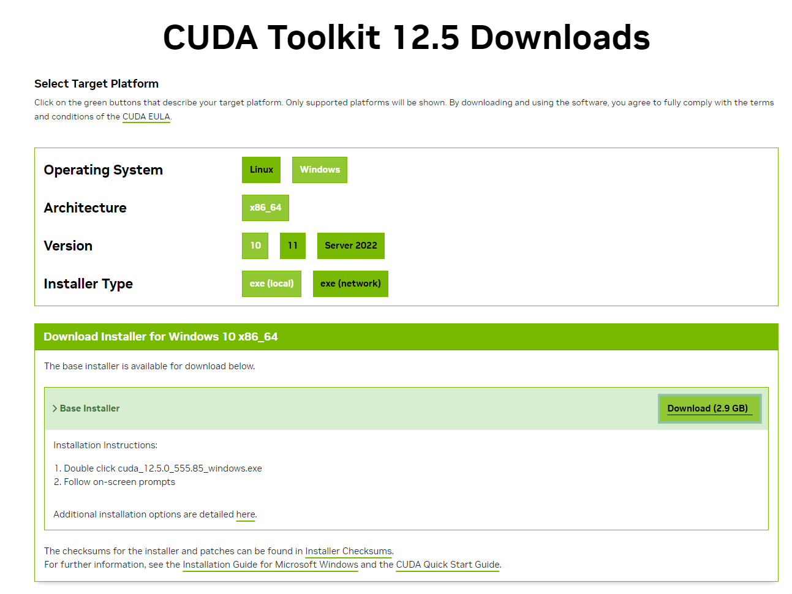
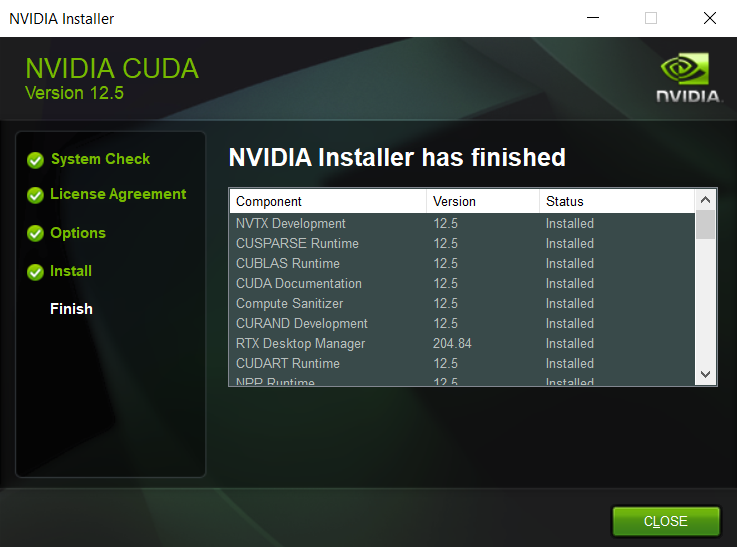

# Hands-On GPU Programming with Python and CUDA - Notes
<a href="https://www.packtpub.com/application-development/hands-gpu-programming-python-and-cuda?utm_source=github&utm_medium=repository&utm_campaign=9781788993913 "></a>

This is the forked code repository for [Hands-On GPU Programming with Python and CUDA](https://www.packtpub.com/application-development/hands-gpu-programming-python-and-cuda?utm_source=github&utm_medium=repository&utm_campaign=9781788993913 ), published by Packt.

### Chapter 01: Why GPU Programming? Technical requirements, Parallelization and Amdahl's Law, Code Profiling
-  CUDA (Pronunciation: coo-duh), a framework for general-purpose GPU (GPGPU) programming from NVIDIA
- Amdahl's Law
    - A method to estimate potential speedup we can get by offloading a program or algorithm onto a GPU/ for a program that can be at least partially parallelized
    - Speedup = 1/((1-p)+p/N)
    - p = parallelizable proportion of execution time for code in original serial program
    - N = Number of processor cores
- Latency: Duration of performing a single computation.
- Power of GPU - TONS of cores MORE than in a CPU, which provides throughput
- Throughput: Number of computations that can be performed simultaneously
- "A GPU is like a very wide city road that is designed to handle many slower-moving cars at once (high throughput, high latency), whereas a CPU is like a narrow highway that can only admit a few cars at once, but can get each individual car to its destination much quicker (low throughput, low latency)."
- ⬆ number of cores of GPU, ⬆ in throughput
- Example: 
    - CPU - 11th Gen Intel(R) Core (TM) i7-11850H @2.50GHz: 8 cores
    - GPU - [NVIDIA RTX A2000](https://www.nvidia.com/content/dam/en-zz/Solutions/design-visualization/rtx-a2000/nvidia-rtx-a2000-datasheet.pdf): 3328 CUDA Cores
    - GPU - [NVIDIA RTX A4000](https://www.nvidia.com/content/dam/en-zz/Solutions/gtcs21/rtx-a4000/nvidia-rtx-a4000-datasheet.pdf): 6144 CUDA Cores
- Exploit throughput, know how to properly parallelize to split workload to run in parallel on multiple processors simultaneously
- Building a house (N number of laborers, N times as fast, N =  speedup of parallelizing a task over the serial version of a task) = parallelizable task
- Profiling code with cPython module, check out [Chapter01/mandelbrot0.ipynb](Chapter01/mandelbrot0.ipynb)
- Advantage of GPU over CPU = ⬆ throughput, execute more parallel code simultaneously on GPU than on a CPU
- "GPU cannot make recursive algorithms or nonparallelizable algorithms somewhat faster"
- Serial vs Parallelizable

### Chapter 02: Setting Up GPU Programming Environment, Technical & Hardware Requirements, GPU Drivers Installation, Setup C++ & Python development environment on Windows & Linux
- Setup Instructions setup available for Ubuntu LTS (long-term support)-based Linux OS (e.g.,  Xubuntu, Kubuntu, or Linux Mint) or Windows 10
- Fast pre-optimized NumPy/SciPy packages <= Intel's Math Kernel Library (MKL)
- Requiremenet: an NVIDIA brand GPU. The CUDA Toolkit is proprietary for NVIDIA cards, so it won't work for programming Intel HD or Radeon GPUs.
- Linux:
    - Open Terminal: `Ctrl + Alt + T`
    - Check processor: `lscpu`
    - Check memory capacity: `free -g` - Display total number of proper memory & memory in swap space
    - Check for Nvidia GPU: `lspci | grep -e "NVIDIA"`
    - Nouveau - an open-source default driver for NVIDIA GPUs in Ubuntu, buts does not work with CUDA
    - Install proprietary driver by adding `graphics-drivers` repository to package manager
        - `sudo add-apt-repository ppa:graphics-drivers/ppa`
        - Synchronize system with the new repo: `sudo apt-get update`
        - Press `Windows + R` and search `software and drivers`
        - Software & Drivers -> Additional Drivers -> Choose the lastest stable proprietary drivers for the GPU (e.g., Using NVIDIA driver metapackage from nvidia-driver-XXX (open source)) -> Apply Changes -> Wait... -> Press `Windows + A` -> Enter `nvidia-settings` -> NVIDIA X Server Settings manager
    - Setup GCC, Eclipse IDE, and graphical dependencies: 
        - `sudo apt-get update`
        - `sudo apt-get install build-essential binutils gdb eclipse-cdt`
            - `build-essential` - gcc, g++ compilers & other utilities such as make
            - `binutils` - useful utilities, such as the LD linker
            - `gdb` - debugger
            - `Eclipse` - IDE
        - `sudo apt-get install freeglut3 freeglut3-dev libxi-dev libxmu-dev` - allow our system to run graphical (OpenGL) stuff included with the CUDA Toolkit
    - Download & Install [CUDA Toolkit](https://developer.nvidia.com/cuda-downloads)
        - `.deb` package (recommended) & a `.run` file (This installs outside of the system's Advanced Package Tool - APT system, which copies the appropriate files to the system's /usr binary and library directories - do this if you know Linux well and know how to work with the Ubuntu's system APT system or repos)
        - Edit `.bashrc` file to configure PATH and LD_SYSTEM_CONFIG environment variables so that the system can find the appropriate binary executable and library files needed for CUDA.
        ```
        export PATH="/usr/local/cuda/bin:${PATH}
        export LD_LIBRARY_PATH="/usr/local/cuda/lib64:${LD_LIBRARY_PATH}"
        ```
    - Install PyCUDA
        - Check where the python binary `which python` else edit `~/.bashrc` file by adding `export PATH="/home/${USER}/anaconda2/bin:${PATH}"`
        - `pip install pycuda`

- Windows
    - Control Panel -> Device Manager
    - 
    - CUDA is very particular about which driver has been installed by the user.
    - "Windows has better CUDA driver compatibility and a more user-friendly installation than Linux."
    - Download & Install GPU drivers for Windows on [NVIDIA Driver Downloads](https://www.nvidia.com/download/index.aspx?lang=en-us)
        - 
        - 
        - 
    - [Install C/C++ on Windows - Guide](https://medium.com/@farid.rahimoff/installing-c-compiler-for-windows-10-and-11-step-by-st-51e760443b02)
    - Download & Install [Visual Studio Community](https://visualstudio.microsoft.com/downloads/)
    - Download & Install [CUDA Toolkit](https://developer.nvidia.com/cuda-downloads), nvcc compiler
        - 
        - 
        - 
        - Check the NVIDIA compiler version information: `nvcc --version`
        - 
    - Install PyCUDA: `pip install pycuda`
        - 
        - If you received error `ImportError: DLL load failed while importing _driver: The specified module could not be found.` when running [Chapter03/deviceQuery.ipynb](Chapter03/deviceQuery.ipynb), add `C:\Program Files\NVIDIA GPU Computing Toolkit\CUDA\v12.5\bin` to PATH

### Chapter 03: Getting Started with PyCUDA, GPU Programming via Python, Transfer data to and from using PyCUDA's gpuarray class, Compile simple CUDA kernels with PyCUDA's ElementwiseKernel function
- GPU Query: To display specific technical details of the GPU, such as available GPU memory and core count, check out [Chapter03/deviceQuery.ipynb](Chapter03/deviceQuery.ipynb)
- Use PyCUDA's gpuarray class to transfer data between the host (CPU) and device (GPU) -
    - Numerical Programming: NumPy's array
    - GPU Programming: PyCUDA's gpuarray
    - Device Memory/ Global DM: 
        - A GPU has its own memory apart from the host computer's (CPU) memory. GPU also has other memories such as additional cache memory, shared memory & register memory.
        - Similar to dynamically allocated heap memory in C (`malloc`, `free`) or C++ (`new`, `delete`)
    - CUDA C
        - Data transfer between  CPU & GPU (`cudaMemcpyHostToDevice`, `cudaMemcpyDeviceToHost`)
        - Keep track of multiple pointers in both the CPU and GPU space and performing proper memory allocations (`cudaMalloc`, `cudaFree`) 
    - Check out [Chapter03/time_calc0.ipynb](Chapter03/time_calc0.ipynb)
    - Check out [Chapter03/explore_gpuarray.ipynb](Chapter03/explore_gpuarray.ipynb)
- Use PyCUDA's ElementWiseKernel for performing pointwise computations
    - kernel: function that is launched directly onto the GPU by CUDA
    - Check out [Chapter03/simple_element_kernel_example0.ipynb](Chapter03/simple_element_kernel_example0.ipynb)
    - gpu_mandelbrot - [Chapter03/gpu_mandelbrot0.py](Chapter03/gpu_mandelbrot0.py)
- Brief foray into functional programming
    - `map`, `reduce` - functions avaialble in functional programmng in Python, both act on functions for their operation.
    ` `lambda` - define anonymous function: throwaway function that we may only wish to use once, or functions that are able to be defined on a single line
    - 
    - `map` with 2 inputs: Function & List of objs, similar to `ElementWiseKernel` - standard design pattern in functional programming, `map(lambda x : x**2, [2,3,4])`
    - 
    - `reduce`: `reduce(lambda x, y : x + y, [1,2,3,4])`
    - `reduce`: associative binary operations, "no matter the order we perform our operation between sequential elements of the list, will always invariably give the same result, provided that the list is kept in order. (This is not to be confused with the commutative property.)"
    - 
- PyCUDA's parallel scan & reduction kernel basics (akin to `reduce`)
    - [Chapter03/simple_scankernel0.py](Chapter03/simple_scankernel0.py)
    - [Chapter03/simple_scankernel1.py](Chapter03/simple_scankernel1.py)
    - `ReductionKernel`
        - dot product from linear algebra
        - `dot_prod = ReductionKernel(np.float32, neutral="0", reduce_expr="a+b", map_expr="vec1[i]*vec2[i]", arguments="float *vec1, float *vec2")`
- Summary:
    - CUDA `deviceQuery`, data transfer via PyCUDA `gpuarray`, `to_gpu`, `get`
    - IPython's `prun` profiler for speed comparison
    - Slowdown first time running GPU functions from PyCUDA due to PyCUDA launching NVIDIA's nvcc compiler to compile inline CUDA C code
    - `ElementwiseKernel` function to compile and launch element-wise operations, which are automatically parallelized onto the GPU from Python
    - functional programming: `map` & `reduce`
    - reduce/scan-type computations on the GPU: `InclusiveScanKernel`, `ReductionKernel`
    - basics of writing and launching kernel functions
